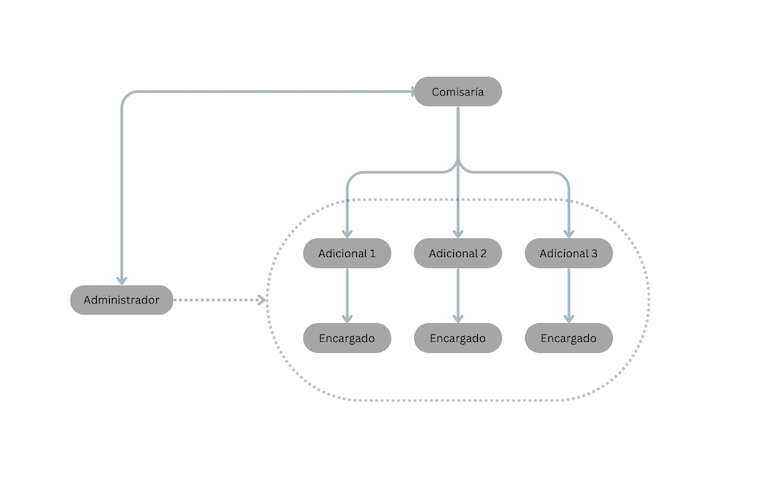
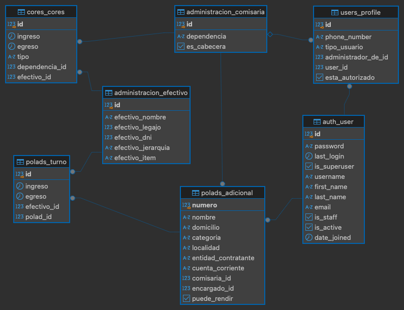

# Gestor de turnos para servicios de Policía Adicional

## Requisitos
- Python 3.6.9
- Django 3.0.5
- PostgreSQL 10.12

## Librerías Complementarias
- django-filter 2.2.0
- django-timedeltatemplatefilter 0.1.2

## Descripción

1. Propósito:

Esta es una webapp escrita en Django y empleada para la gestión de servicios de policía adicional en la Provincia de Buenos Aires. Tiene como propósito facilitar la confección de la documentación requerida y permitir que usuarios no familiarizados con Excel puedan hacerla cómodamente, minimizando el margen de error que supone la confección manual. 

2. ¿Cómo funciona?

La Policía de la Provincia de Buenos Aires presta servicios de Policía Adicional a entidades de carácter público o privado que así lo soliciten (Ley 13942 y su Decreto Reglamentario 545/2022).

Los agentes de seguridad, hallándose en horario franco de su servicio regular, tienen la opción de cumplimentar adicionales para dichas entidades, según un monto fijado por el Ministerio de Seguridad en lo que respecta al valor de la hora de cobertura y de acuerdo a una categorización determinada. La documentación debe gestionarse desde la Comisaría jurisdiccional en la que esa entidad solicitante esté emplazada, y la tarea de confección se halla a cargo de un único policía que cumple funciones como responsable de la Oficina de Administración. 

En virtud de que, en ocasiones, la cantidad de servicios de Policía Adicional exceden la capacidad operativa de una única persona (el Administrador), una práctica habitual consiste en delegar la gestión de cada Servicio Adicional en una persona (el Encargado) que será responsable de organizar los cronogramas de cobertura y mantener un contacto más fluido con la Entidad Contratante. Sin embargo, la responsabilidad última será siempre del Administrador. 

## Estructura de la Base de Datos. 

### Diagrama ERD.

### Principales tablas.

1. users_profile. Modelo vinculado al modelo auth_user.

| Campo               | Tipo                  | Restricciones | Not Null |
| ------------------- | --------------------- | ------------- | -------- |
| id                  | integer               |               | Sí       |
| phone_number        | character varying(15) |               | Sí       |
| tipo_usuario        | character varying(25) |               | Sí       |
| administrador_de_id | integer               |               | No       |
| user_id             | integer               |               | Sí       |
| esta_autorizado     | boolean               |               | Sí       |

- Al registrarse un nuevo usuario, por razones de privacidad no puede acceder de forma automática a la app. Deberá ser cambiado su valor en el atributo booleano esta_autorizado por el Superusuario. Una vez concedido el permiso, el usuario deberá establecer su tipo de usuario. Aquí, existen todos tipos: administrador o encargado. En caso de ser encargado, administrador_de_id quedará nulo. Ya que, según se ha explicado, por la dinámica un encargado puede ser responsable de servicios de policía adicional existentes en más de una jurisdicción. En caso de ser administrador, deberá indicar necesariamente cuál es la comisaría de la que resulta responsable, en una relación uno a uno - un administrador por comisaría. 

Esto permitirá, más adelante, establecer un correcto sistema de permisos para visualizar sólo aquello que a cada tipo de usuario le está permitido. 

Ejemplo: 

Pedro es Administrador de Comisaría 1era. Además, es encargado de Servicio 1. 
María es Administradora de Comisaría 2da. Además, es encargada de Servicio 2, y Servicio 4.
Pablo es Encargado de Servicio 3 (competencia de Comisaría 1era) y Servicio 5 (competencia de Comisaría 2da).

Al acceder a la app, visualizarán lo siguiente:

Pedro verá lo concerniente a Servicio 1 y Servicio 3.
María verá lo concerniente a Servicio 2, Servicio 4, y Servicio 5. 
Pablo verá lo concerniente a Servicio 3 y Servicio 5.

2. polads_adicional.

| Campo               | Tipo                  | Restricciones | Not Null |
| ------------------- | --------------------- | ------------- | -------- |
| numero              | integer               |               | Sí       |
| nombre              | character varying(100)|               | Sí       |
| domicilio           | character varying(100)|               | Sí       |
| categoria           | character varying(4)  |               | Sí       |
| localidad           | character varying(50) |               | Sí       |
| entidad_contratante | character varying(100)|               | Sí       |
| cuenta_corriente    | character varying(100)|               | Sí       |
| comisaria_id        | integer               |               | Sí       |
| encargado_id        | integer               |               | Sí       |
| puede_rendir        | boolean               |               | Sí       |

- Cada servicio de Policía Adicional posee un número de identifcación número, según los registros internos de cada Comisaría y, a su vez, declarados ante el Ministerio de Seguridad. El resto de los parámetros especifican la categoría (cada categoría pagará luego un valor distinto por hora trabajada y con este parámetro serán posteriormente calculados los montos en la confección del documento Excel), el domicilio en donde se presta el servicio, la cuenta corriente ministerial en la que se deposita, y dos atributos relevantes para la estructura de la base de datos: comsisaria_id y encargado_id. La comisaria_id refiere a la Comisaría a través de la cual se rinde el servicio y encargado_id refiere al usuario responsable del mismo.

Ejemplo:

Servicio 1. 
numero = 1
nombre = 'Servicio 1' 
domicilio: 'Calle Nro. 123'
categoria: '3era'
localidad: 'Bahía Blanca'.
entidad_contratante: 'Casa Matriz de Servicio 1'.
cuenta_corriente: '34134/0'.

3. administracion_comisaria

| Campo       | Tipo                  | Restricciones | Not Null |
| ----------- | --------------------- | ------------- | -------- |
| id          | integer               |               | Sí       |
| dependencia | character varying(100)|               | Sí       |
| es_cabecera | boolean               |               | Sí       |

- Aquí conviene a destacar que no todas las Comisarías son cabeceras. Existen Subcomisarías, Destacamentos, o Puestos de Vigilancia que no tienen la potestad de rendir servicios de Policía Adicional, ya que sólo rinden las cabeceras. No obstante, estas dependencias de rango inferior también pueden utilizar las herramientas que brinda esta webapp para otro tipo de funcionalidades, según veremos más adelante. Entonces, el valor es_cabecera será True y al crear un nuevo servicio de policía adicional, las opciones presentadas en comisaria_id serán sólo de aquellas que sean cabeceras.

4. polads_turno

| Campo       | Tipo                      | Restricciones | Not Null |
| ----------- | ------------------------- | ------------- | -------- |
| id          | integer                   |               | Sí       |
| ingreso     | timestamp with time zone  |               | No       |
| egreso      | timestamp with time zone  |               | No       |
| efectivo_id | integer                   |               | Sí       |
| polad_id    | integer                   |               | Sí       |

- Detalle de los turnos cumplimentados: qué efectivo lo cumplió, a qué adicional corresponde, su fecha de ingreso y de egreso.

5. cores_cores

| Campo          | Tipo                      | Restricciones | Not Null |
| -------------- | ------------------------- | ------------- | -------- |
| id             | integer                   |               | Sí       |
| ingreso        | timestamp with time zone  |               | No       |
| egreso         | timestamp with time zone  |               | No       |
| tipo           | character varying(13)     |               | Sí       |
| dependencia_id | integer                   |               | Sí       |
| efectivo_id    | integer                   |               | Sí       |

- Además de horas de policía adicional, los efectivos cumplimentan horas de COmpensación por REcargo de Servicio: llamadas Horas Cores. La asignación y el relevamiento de las mismas están a cargo del Administrador. Por lo que, si el tipo de usuario es Administrador, accederá a este módulo. Esta es la razón por la que se pueden crear usuarios Administradores de Dependencias no cabecera o de menor rango. En tanto éstas poseen su propio cupo de horas cores, tienen la posibilidad de distribuirlas y monitorear cuántas han sido asignada en el mes en curso a cada efectivo policial. 

## Módulos principales. 

1. Comisaría, Efectivo. 
2. Adicional, Turno.
3. Cores.

- Cada Comisaría es respnosable de uno o varios Adicionales.
- Cada Adicional es responsabilidad de un Encargado.
- Este encargado puede ser sólo encargado o, a su vez, administrador.
- En caso de ser Administrador, el sistema de permisos le permitirá asignar turnos a los Adicionales de los cuales es responsable, y además verá los turnos que han sido designados por otros encargados que posean Adicionales en la jurisdicción que administra.
- Cada Comisaría puede tener un único Administrador. Y viceversa.
- Cualquier efectivo puede realizar turnos de Adicional o Cores en cualquier Comisaría.

Este sistema de permisos garantiza la privacidad de cada usuario según su nivel de responsabilidad. Sin embargo, los turnos de policía adicional y las horas cores se verifican mutuamente en cada asignación, de modo tal que, en caso de existir superposición en la base de datos con otro turno asignado al mismo efectivo, éste sea rechazado como inválido, dándole aviso a quien intentó cargarlo de cuál es la persona responsable con la que debe hablar. Por ejemplo: si Administrador de Comisaría 3era intenta cargar horas cores para el Efectivo Pablo, y éste, a su vez, se encuentra cumplimentando un Adicional correspondiente a Comisaría 1era, el turno de cores no podrá ser asignado. Cuando el responsable de ese Adicional reciba el aviso de invalidez, el mensaje de error contendrá el nombre de Usuario de Administrador Comisaría 3era. Esta superposición no sólo coteja la totalidad de los turnos. En caso de solapamiento de una hora, la carga resultará igualmente inválida.

## Flujo. Descripción de las Views principales.

- Una vez autorizado, y habiendo iniciado sesión con sus credenciales, el Usuario accederá a una vista de Escritorio. Una barra lateral derecha le permitirá actualizar su perfil para establecer su tipo de usuario (Administrador o Encargado). 
- La vista por defecto (Encargado) permite acceder a dos opciones: "Mis Adicionales" o "Nuevo Adicional". 
- La vista del usuario Encargado, además, contendrá las opciones del módulo Cores: "Cargar Cores", "Ver Cores", "Cupo / Rendición".

Estas opciones, ubicadas en la barra lateral derecha, permite acceder a las vistas principales. A continuación, una breve descripción de cada una.

1. Mis Adicionales.

- Presenta un listado de Adicionales. En caso de ser Encargado, de aquellos Adicionales de los que sos responsable. En caso de Administrador, de aquellos adicionales de los que sos responsable, y todos aquellos que se encuentren en tu jurisdicción.

Tipo de Usuario: Encargado. 
Nombre: Pablo. 
Responsable de: Adicional 2 (Comisaría 1era), Adicional 4 (Comisaría 2da), y Adicional 5 (Comisaría 1era).
Vista al entrar a "Mis Adicionales":

| Numero       | Nombre       | Comisaría      | Encargado | Turnos  | Calendario | Rendir |
| ------------ | ------------ | -------------- | --------- | ------- | ---------- | ------ |
| 2            | Adicional 2  | Comisaría 1era | Pablo     | Agregar | Ver        | Rendir |
| 4            | Adicional 4  | Comisaría 2da  | Pablo     | Agregar | Ver        | Rendir |
| 5            | Adicional 5  | Comisaría 1era | Pablo     | Agregar | Ver        | Rendir |

Tipo de Usuario: Administrador.
Administrador de: Comisaría 1era.
Nombre: María.     
Responsable de: Adicional 1.
En su jurisdicción: Adicional 2, Adicional 5.
Vista al entrar a "Mis Adicionales":

| Numero       | Nombre       | Comisaría      | Encargado | Turnos  | Calendario | Rendir |
| ------------ | ------------ | -------------- | --------- | ------- | ---------- | ------ |
| 1            | Adicional 1  | Comisaría 1era | María     | Agregar | Ver        | Rendir |
| 2            | Adicional 2  | Comisaría 1era | Pablo     |         | Ver        |        |
| 5            | Adicional 5  | Comisaría 1era | Pablo     |         | Ver        |        |

- Turnos: Agregar. Permite acceder a la pantalla de carga de turnos. En donde se detallará el ingreso y egreso (a través de un datepicker de JS que abre un calendario y hora) y qué efectivo lo cumplimentó. También, a través de JS, al empezar a tipear el apellido o nombre del efectivo en el input, se genera automáticamente una lista de opciones posibles en donde aparece el nombre completo del mismo según consta en la base de datos y seguidamente su jerarquía y legajo, para evitar errores entre homónimos si los hubiera.
- Calendario: Ver. Presenta una vista en formato calendario mensual con cada uno de los turnos asignados para ese adicional. Permite una mejor visualización de todo lo que ha sido cargado. 
- Rendir: Rendir. Se accede a un listado de todos los turnos cargados, que pueden filtrarse entre dos fechas determinadas (habitualmente correspondientes al mismo mes), y rendirse. Lo que significa que se procesarán esos turnos y serán descargados en un archivo Excel de acuerdo a planillas y documentación requeridas por el Ministerio de Seguridad para proceder a su liquidación. De este modo se evita la confección manual, que solía contener errores en números de DNI o legajo. Como también su monto. Ya que al ser variable de acuerdo a la categoría, la confección manual provoca equivocaciones que retrasaban los pagos.

2. Nuevo Adicional.

- Creación de un nuevo Adicional. Allí se consignan todo sus atributos. Inclusive su categoría (primera, segunda, tercera, cuarta, o quinta) y la Comisaría jurisdiccional responsable. El usuario creador será el Encargado por defecto. Esto luego puede ser modificado por alguien con permisos de Superusuario en Django. Es decir, Adicional 7, a cargo de Pablo, puede ser modificado luego resultando la encargada María, sin perderse los turnos que ya fueron cargados históricamente, pero desapareciendo de las vistas de Pablo y apareciendo en las vistas de María. Una vez creado, pasará a formar parte de la lista en Mis Adicionales.

3. Cargar Cores.

- Similar a la carga de turnos, aquí sólo podrán acceder los usuarios Administrador, según fuera explicado según los niveles de permisos y responsabilidad de cada quien.

4. Ver Cores.

- Del mismo modo que pueden filtrarse los turnos en un rango de fechas para servicios Adicionales, el usuario Administrador podrá filtrar turnos de Horas Cores, no sólo por fecha, sino también de cada Efectivo. 

5. Cupo / Rendición.

- Las horas Cores se rinden mensualmente de acuerdo a un cupo determinado que varía de acuerdo a la Dependencia Policial. Esta vista permitirá llevar una contabilización parcial en cualquier momento del mes según cuántas horas Cores fueron ya asignadas y cumplimentadas, así se monitorea el cupo parcial hasta el momento de su rendición. Completado el cupo correspondiente al mes en curso, desde aquí se podrá descargar en un archivo Excel la rendición. Nuevamente, de acuerdo a los parámetros de confección dados por el Ministerio de Seguridad.
- En esta vista, además, se podrá acceder a la cantidad individual de horas que cada efectivo cumplimentó en esa Comisaría en particular, ordenados éstos por su jerarquía y número de legajo. 

## Otras funcionalidades.

- Dado que pueden existir superposiciones y no necesariamente todos los usuarios deben conocerse personalmente, se implementó un módulo de mensajería interna (Mensajes) desde el cual cada usuario puede enviar y recibir mensajes.
- De acuerdo con las reglamentaciones internas de la Policía de la Provincia de Buenos Aires, ningún efectivo puede cumplimentar más de 180 horas de Policía Adicional en un mismo mes calendario, ni más de 80 horas de Horas Cores. Dentro de las views para ingresar los turnos, se incorporó una validación que verifica que ningún efectivo exceda este cupo. Una vez cumplimentadas las 180 horas, por ejemplo, la carga del turno siguiente será inválida, visualizando el mensaje de error: "Turno inválido, el efectivo NOMBRE ha superado el límite mensual de Horas de Policía Adicional" o de Horas Cores, según corresponda. 